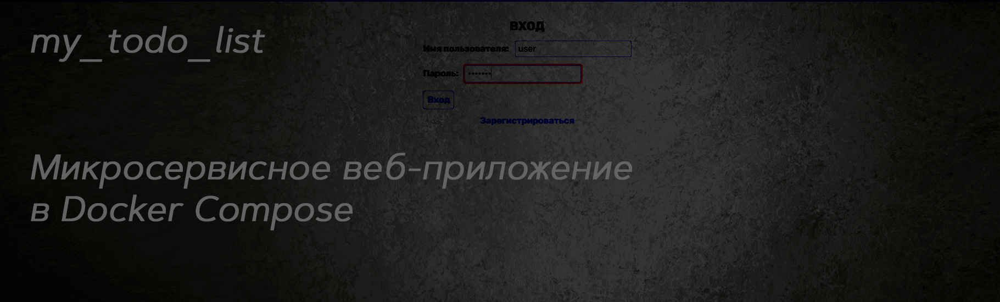
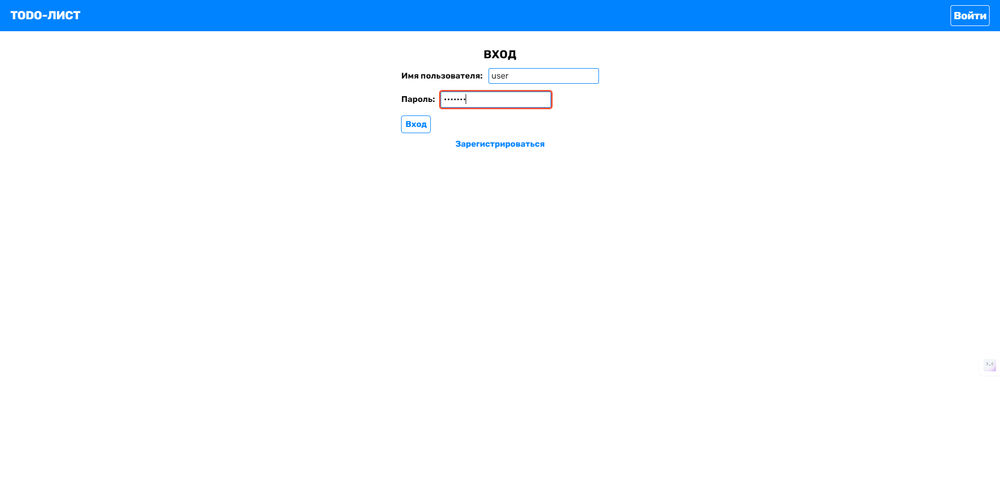
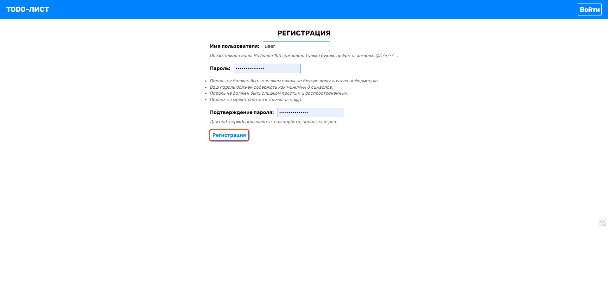
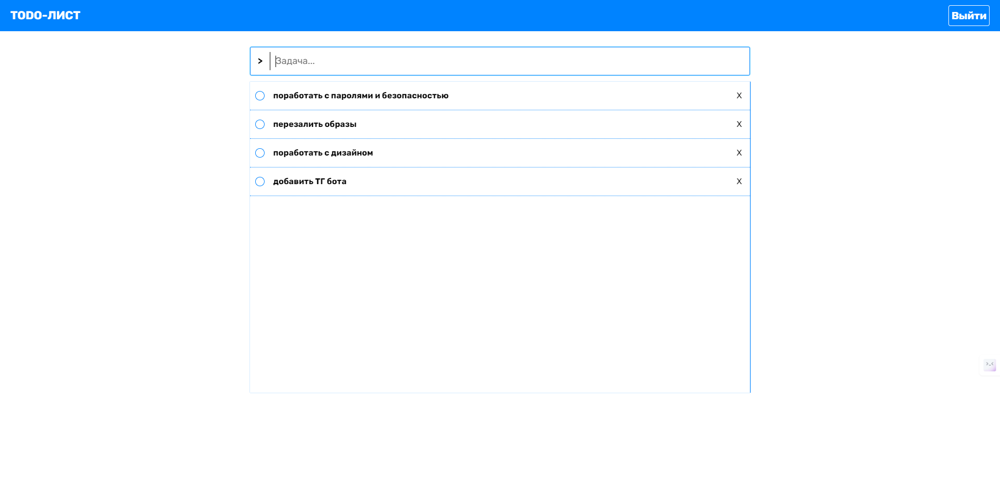

  

Простой Docker-образ для приложения Todo List, построенного на Django.  
Приложение позволяет пользователям создавать, читать, обновлять и удалять задачи в списке дел.

Образ включает в себя:
- База данных PostgreSQL
- Фреймворк Django
- Веб-сервер Nginx

## Содержание
1. [Интерфейс приложения](#интерфейс-приложения)
2. [Структура базы данных](#база-данных)
3. [Переменные окружения](#переменные-окружения)
4. [Docker Compose файл](#docker-compose-файл)
5. [Запуск приложения](#команды-для-локального-разворачивания-приложения)


## Интерфейс приложения

Приложение ежедневника имеет простой и интуитивно понятный интерфейс.  
После регистрации и входа в систему, пользователь попадает на главную страницу, где отображается список его задач.

<details>
  <summary>Показать: первый вход</summary>
  
  

</p>
</details>

<details>
  <summary>Показать: регистрация</summary>


</p>
</details>

<details>
  <summary>Показать: интерфейс</summary>


</p>
</details>


### Основные возможности интерфейса:  
1. **Добавление задачи**: пользователь может добавить новую задачу указав ее название  
2. **Отметка задачи как выполненной**: пользователь может отметить задачу как выполненную  
3. **Удаление задачи**: пользователь может удалить ненужную задачу из списка  

Все задачи пользователя сохраняются в базе данных PostgreSQL, которая развертывается в контейнере вместе с остальными компонентами приложения.


## База данных

Приложение использует таблицу PostgreSQL:

| Поле     | Тип     | Описание                                                 |
|----------|---------|-----------------------------------------------------------|
| `id`     | `SERIAL PRIMARY KEY` | Уникальный идентификатор задачи, генерируется автоматически |
| `content` | `TEXT NOT NULL` | Поле для хранения содержимого задачи |
| `status` | `TEXT NOT NULL` | Поле для хранения статуса задачи (например, "Выполнено", "В процессе") | 


## Переменные окружения

Следующие переменные окружения используются для конфигурации приложения:

| Variable                    | Description                                |
| --------------------------- | ------------------------------------------ |
| `POSTGRES_DB`               | Имя базы данных PostgreSQL		           |
| `POSTGRES_USER`             | Имя пользователя БД PostgreSQL   		   |
| `POSTGRES_PASSWORD`         | Пароль для базы данных PostgreSQL		   |
| `PG_HOST`                   | Имя хоста базы данных PostgreSQL	       |
| `PG_NAME`                   | Имя базы данных PostgreSQL		           |
| `PG_USER`                   | Имя пользователя БД PostgreSQL для бэкэнда |
| `PG_PASSWORD`               | Пароль БД PostgreSQL для бэкэнда 		   |
| `DJANGO_SUPERUSER_USERNAME` | Имя суперпользователя Django     		   |
| `DJANGO_SUPERUSER_PASSWORD` | Пароль для суперпользователя Django	       |
| `DJANGO_SUPERUSER_EMAIL`    | Электронная почта суперпользователя Django |


## Docker Compose файл

Файл `docker-compose.yml` содержит описание всех необходимых сервисов для развертывания приложения ежедневника в Docker-контейнерах:

1. **database**: Сервис, отвечающий за развертывание базы данных PostgreSQL  
Для хранения данных используется volume `todo_vol`   
Использует образ `aeonix1992/my_todo_list_db`, настраивается с помощью переменных окружения из `.env`   

2. **backend**: Сервис, отвечающий за развертывание бэкенда приложения, написанного на Django  
Использует образ `aeonix1992/my_todo_list_backend`, настраивается с переменными окружения, связанными с базой данных  

3. **frontend**: Сервис, отвечающий за развертывание фронтенда приложения  
Использует образ `aeonix1992/my_todo_list_frontend:0` и публикует порт 80 на хосте  

4. **backend-migrations**: Сервис, который выполняет миграции базы данных для бэкенда  
Использует тот же образ, что и сервис backend, запускает команду `make migrate`  

5. **backend-superuser**: Сервис, который создает суперпользователя Django  
Он использует тот же образ, что и сервис backend, запускает команду `make create-superuser`  

Все сервисы зависят друг от друга, и их запуск происходит в правильном порядке, чтобы обеспечить корректную работу приложения.

Переменные окружения, используемые в этом файле, должны быть определены в файле .env, который не включен в репозиторий по соображениям безопасности.


## Команды для локального разворачивания приложения

Чтобы команды сработали, нужно находиться в текущей папке (`my_todo_list`)
 - Добавляем файл .env с вашими переменными окружения (шаблон ниже)
 - Поднимаем контейнеры с приложением: ```docker-compose up``` 
 - Дожидаемся запуска всех сервисов
 - Заходим на сайт [http://localhost](http://localhost)

<details>
  <summary>Шаблон файла с переменными окружения</summary>

Добавить файл .env, подставить ваши значения после `=`, за исключением `PG_HOST=database`
```text
POSTGRES_DB=
POSTGRES_USER=
POSTGRES_PASSWORD=
PG_HOST=database
PG_NAME=
PG_USER=
PG_PASSWORD=
DJANGO_SUPERUSER_USERNAME=
DJANGO_SUPERUSER_PASSWORD=
DJANGO_SUPERUSER_EMAIL=example@example.com
```
</p>
</details>


## Участие

Если вы обнаружили какие-либо проблемы или у вас есть предложения по улучшению, пожалуйста, создайте новый `issue` или отправьте `pull request`.

## Лицензия

Этот проект лицензирован [MIT License](LICENSE).
